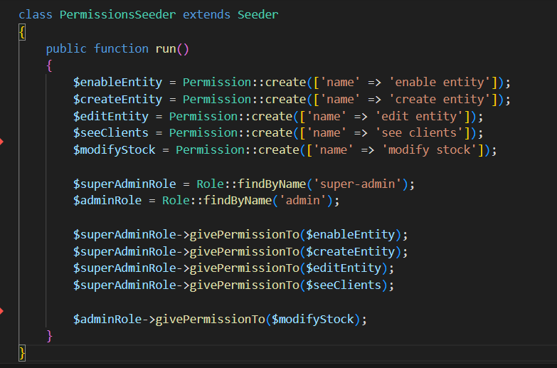

# Roles en Laravel

## Descripción

#### Se implementó con la libreria Laravel Permission de Spatie en el backend, y se tiene un user admin y super admin con distintas facultades.  Se permite administrar roles y facultades de manera sencilla a través de la asociación muchos a muchos entre usuarios y roles (admin y superadmin).

#### Se eligió Spatie porque es una librería muy popular y bien mantenida, con una buena documentación y soporte. Además, permite crear permisos y roles de manera sencilla y rápida.

Se implementa la creación y vinculación entre permisos y roles en el seeder de la base de datos.

#### Como buena práctica, Spatie recomienda no usar los roles directamente, sino crear un nuevo rol y asignarle los permisos que se necesiten. En este caso, se creó el rol de superadmin y se le asignaron todos los permisos disponibles. Luego, a la hora de checkear si el usuario tiene un rol o permiso, se recomienda usar consultas de permisos en lugar de usar consulta de rol. Esto es porque los roles pueden cambiar, pero los permisos son más estables y no cambian con frecuencia. 
#### Esto permite una segregación de facultades más modular y flexiblee, evitando roles similares. Además, esto permite usar directivas @can en las vistas de Blade, lo que permite que se use Laravel Gates, que provee ventanas de autorización para el frontend.

# Servicio web en Laravel

## Descripción

#### Se implementó la feature de descripción mejorada a través de IA generativa provista por Google Gemini a través de su API. Se usó gemini-api-php/client, un paquete que encapsula y simplifica el uso de la API de Gemini. Se implementó un botón dentro del formulario de creación de productos del dashboard de superadmin que toma el título actual del producto y devuelve una descripción mejorada.

#### Se decidió usar la IA de Google Gemini porque es competitiva en el mercado actual y tiene buen rendimiento en cuestión de velocidad y calidad de respuesta. Se usó el modelo Gemini 1.5 Pro porque tiene un buen rendimiento y razonamiento pero la herramienta provee flexibilidad para elegir el modelo que se necesite.

# Servicio web en JS

## Descripción

#### Se decidió implementar un chatbot de asistencia al usuario en el frontend, que permite al usuario hacer preguntas con respuestas predefinidas o entablar conversación con operadores de la tienda. Se usa tawk.to, una plataforma que simplifica la integración de este tipo de features. Se implementó un botón en la parte inferior derecha de la pantalla que permite abrir el chat y hacer preguntas.

#### Tawk.to provee tanto una plataforma para conectar operarios que pueden chatear en tiempo real con los visitantes como tambien una suite de herramientas que permiten respuestas automaticas vía IA o respuestas predefinidas si se desea (El ejemplo de arriba es un intercambio de mensajes en los que no hubo operario humano interviniendo). Esto permite una buena experiencia de usuario y una buena atención al cliente. 

#### Se decidió usar Tawk.to porque es una plataforma muy popular, de facil integración y bien mantenida, con una buena documentación y soporte. Además, permite crear respuestas automáticas de manera sencilla y rápida.

Panel de operarios

# Administración de archivos

## Descripción

#### Se implementó el uso de imagenes a través de Supabase Storage, un servicio de almacenamiento de archivos en la nube. 

#### El dashboard de buckets dentro del proyecto supabase nos permite hacer un abm y lectura de archivos de varios tipos, proveyendo tambien URLs para acceder a los archivos.

#### Se usó Supabase Storage con Buckets ya que el sistema ya estaba instanciando un proyecto supabase. Esto hizo su setup más sencillo y rápido. Además, los buckets son sencillos de entender y visualizar para la administración de imagenes.

# PWA

## Descripción

#### Se transformó la aplicación web desarrollada en React en una Progressive Web App (PWA) para mejorar la experiencia del usuario en dispositivos móviles y permitir su instalación como una app nativa.

#### Una PWA permite que la aplicación se instale en el dispositivo del usuario, funcione sin conexión (offline), cargue más rápido y ofrezca una experiencia similar a una app móvil. Esto mejora el compromiso del usuario y su percepción de rendimiento.

#### Para ello, se realizaron los siguientes pasos:

### Paso 1: Modificación del archivo manifest.json

#### El archivo manifest.json contiene la metada necesaria para definir cómo se verá e identificará la app cuando esté instalada. En nuestro proyecto, está ubicado en la-gloria-store/build/manifest.json

#### Se puede ver que contiene datos de los íconos de la app, el nombre, la descripción, url como entry point, entre otros.

#### Paso 2: Registro del Service Worker

#### React provee soporte para PWA. Si se usó el comando create-react-app para iniciar la app, se puede usar el archivo serviceWorker.js que viene por defecto. Si no, lo creamos (en nuestro caso, está en la-gloria-store/public/service-worker.js). Luego, lo registramos en el index.js de la app.

#### En la imagen se puede ver cómo se agrega el service worker (con el método register) luego de cargar (evento escuchado con window.addEventListener('load')). Esto solo se hace si se detectó que el navegador soporta service workers (con la instrucción if ('serviceWorker' in navigator)).

#### Paso 3: Instalación y configuración del Service Worker

##### En el archivo service-worker.js,