# Roles en Laravel

## Descripción

#### Se implementó con la libreria Laravel Permission de Spatie en el backend, y se tiene un user admin y super admin con distintas facultades.  Se permite administrar roles y facultades de manera sencilla a través de la asociación muchos a muchos entre usuarios y roles (admin y superadmin).

#### Se eligió Spatie porque es una librería muy popular y bien mantenida, con una buena documentación y soporte. Además, permite crear permisos y roles de manera sencilla y rápida.

#### Como buena práctica, Spatie recomienda no usar los roles directamente, sino crear un nuevo rol y asignarle los permisos que se necesiten. En este caso, se creó el rol de superadmin y se le asignaron todos los permisos disponibles. Luego, a la hora de checkear si el usuario tiene un rol o permiso, se recomienda usar consultas de permisos en lugar de usar consulta de rol. Esto es porque los roles pueden cambiar, pero los permisos son más estables y no cambian con frecuencia. 

# Servicio web en Laravel

## Descripción

#### Se implementó la feature de descripción mejorada a través de IA generativa provista por Google Gemini a través de su API. Se usó gemini-api-php/client, un paquete que encapsula y simplifica el uso de la API de Gemini. Se implementó un botón dentro del formulario de creación de productos del dashboard de superadmin que toma el título actual del producto y devuelve una descripción mejorada.

#### Se decidió usar la IA de Google Gemini porque es competitiva en el mercado actual y tiene buen rendimiento en cuestión de velocidad y calidad de respuesta. Se usó el modelo Gemini 1.5 Pro porque tiene un buen rendimiento y razonamiento pero la herramienta provee flexibilidad para elegir el modelo que se necesite.

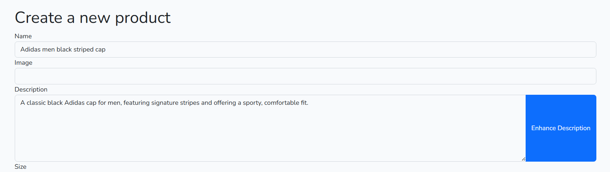

# Servicio web en JS

## Descripción

#### Se decidió implementar un chatbot de asistencia al usuario en el frontend, que permite al usuario hacer preguntas con respuestas predefinidas o entablar conversación con operadores de la tienda. Se usa tawk.to, una plataforma que simplifica la integración de este tipo de features. Se implementó un botón en la parte inferior derecha de la pantalla que permite abrir el chat y hacer preguntas.

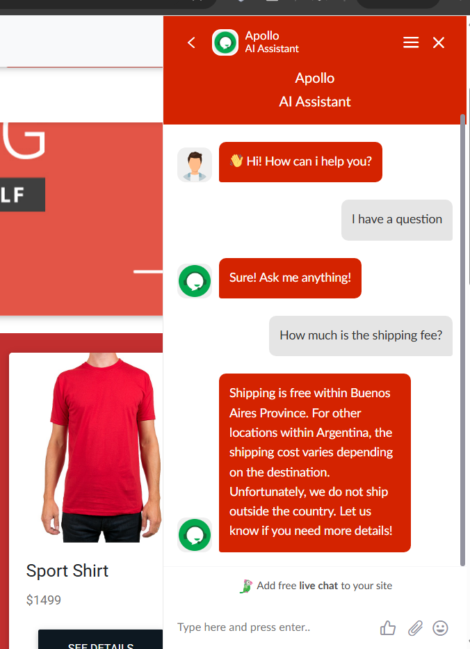

#### Tawk.to provee tanto una plataforma para conectar operarios que pueden chatear en tiempo real con los visitantes como tambien una suite de herramientas que permiten respuestas automaticas vía IA o respuestas predefinidas si se desea (El ejemplo de arriba es un intercambio de mensajes en los que no hubo operario humano interviniendo). Esto permite una buena experiencia de usuario y una buena atención al cliente. 

#### Se decidió usar Tawk.to porque es una plataforma muy popular, de facil integración y bien mantenida, con una buena documentación y soporte. Además, permite crear respuestas automáticas de manera sencilla y rápida.

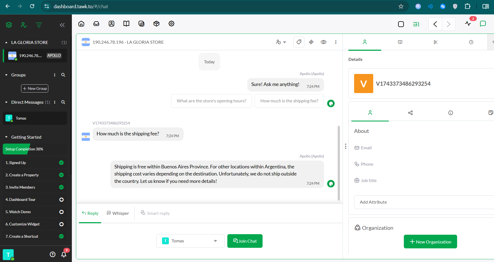

Panel de operarios

# Administración de archivos

## Descripción

#### Se implementó el uso de imagenes a través de Supabase Storage, un servicio de almacenamiento de archivos en la nube. 

#### El dashboard de buckets dentro del proyecto supabase nos permite hacer un abm y lectura de archivos de varios tipos, proveyendo tambien URLs para acceder a los archivos.

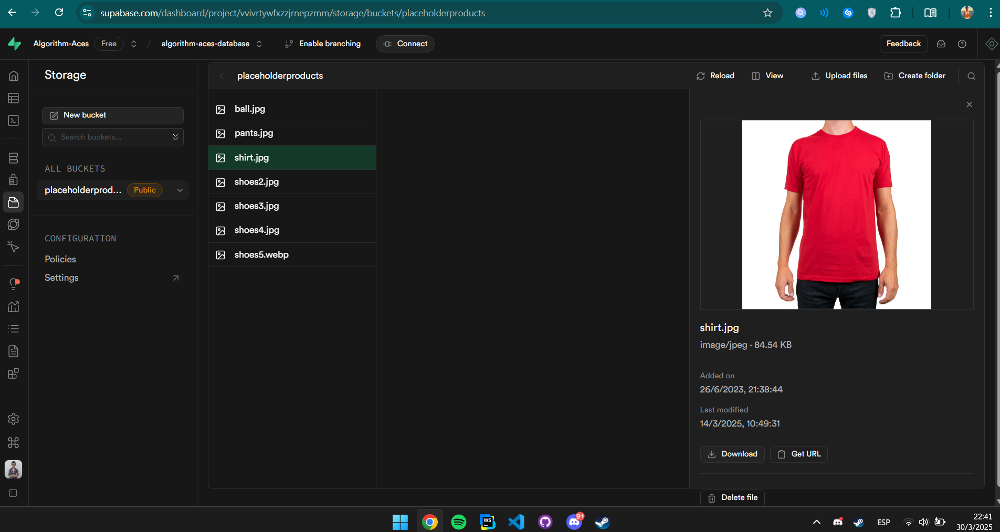

#### Se usó Supabase Storage con Buckets ya que el sistema ya estaba instanciando un proyecto supabase. Esto hizo su setup más sencillo y rápido. Además, los buckets son sencillos de entender y visualizar para la administración de imagenes.

# PWA

### Descripción

#### Se transformó la aplicación web desarrollada en React en una Progressive Web App (PWA) para mejorar la experiencia del usuario en dispositivos móviles y permitir su instalación como una app nativa.

#### Una PWA permite que la aplicación se instale en el dispositivo del usuario, funcione sin conexión (offline), cargue más rápido y ofrezca una experiencia similar a una app móvil. Esto mejora el compromiso del usuario y su percepción de rendimiento.

#### La aplicacion PWA funciona para los sistemas operativos Windows, Linux, Android, IOS

### Para instalarla (Google Chrome)

#### Hacemos click en el siguiente icono arriba a la derecha en el buscador

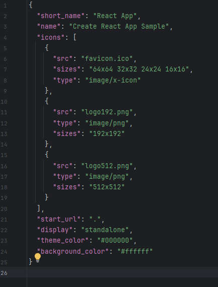

#### Luego le damos click al boton instalar

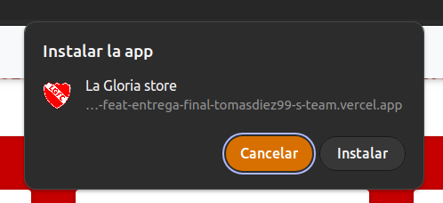

#### Y ya podremos ver la aplicacion en nuestro escritorio

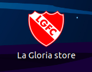

### Para instalarla (Safari IOS)

#### Primero dirigirnos a la pagina y darle a compartir y luego le damos click a Add to Home Screen

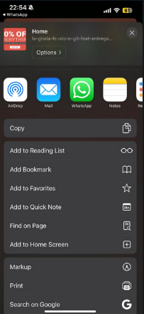

#### Hacemos click en Add

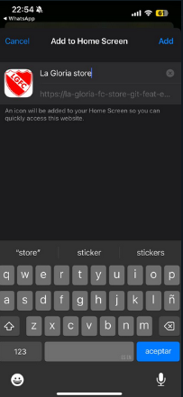

#### Luego ya la podremos visualizar en nuestro telefono

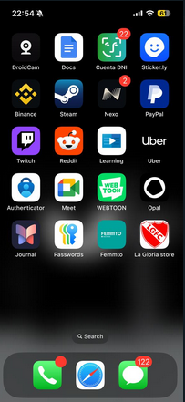

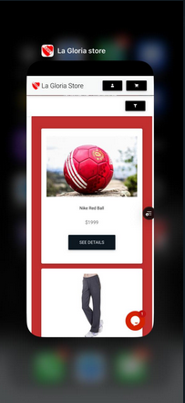

### Funcionalidades PWA

#### Cuando inicia la carga de la app, el service worker guarda en cache recursos que se usan con frecuencia (imagenes del carrousel, por ejemplo). Esto permite que la app funcione offline y cargue más rápido.

#### Además, cuando se navega por la app, el service worker intercepta las peticiones e intenta responder con los recursos cacheados en lugar de hacer una nueva a la red, ahorrando tiempo y tráfico.

#### Si durante la navegación de la app se pierde la conexión, hay ciertas funcionalidades y vistas que siguen siendo accesibles. Por ejemplo, el carrousel de imagenes y la vista de productos que hayan sido visitados previamente (ya que están cacheados). Las páginas del home previamente vistas tambien son accesibles.

#### El carrito de compras es visualizable totalmente aún sin conexión y la manipulación del mísmo tambien, ya que se maneja en el lado del cliente. Sin embargo, el checkout no es accesible sin conexión, ya que requiere una conexión a Mercado Pago para poder procesar el pago.

##### Cuando se quiere acceder a un sitio que requiere mandatoriamente conexion a red, se redirige automaticamente a un sitio offline mostrando un mensaje de error.

# Guias de accesibilidad

### 1.4.3 Contrast (Minimum)

#### La presentación visual del texto y las imágenes del texto tiene una relación de contraste de al menos 4,5:1 
#### Se utiliza la pagina Contrast Checker https://webaim.org/resources/contrastchecker/ para comprar contraste de colores

### 1.1.1 Non-text Content

#### Todo contenido no textual que se presenta al usuario tiene una alternativa de texto que cumple la misma función, excepto en las situaciones que se enumeran a continuación.

#### Para lograr esta guia se les agrega el atributo "alt" a las imagenes, a los botones se les agrega un atributo "aria-label"

#### Para chequear que no se nos haya pasado por alto algun lugar que agregar estos atributos, utilizamos la extension WAVE que tiene funcionalidades para verificar accesibilidad

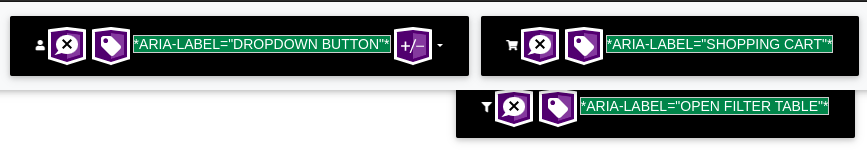

### 2.1.1 Keyboard | 2.1.2 No Keyboard Trap | 2.4.7 Focus Visible  

#### Se puede navergar a traves de toda la pagina mediante del uso del teclado, sin la posibilidad de quedarse atrapado en un componente, tambien la pagina matiene un orden logico Top-Down  al navegar con el teclado. Al moverse por la pagina con el teclado mediante css hicimos que se encuadre el componente.

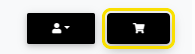

#### Tambien hicimos uso de la herramienta LightHouse provista por Google Chrome para probar los elementos que esta puede testear automaticamente 

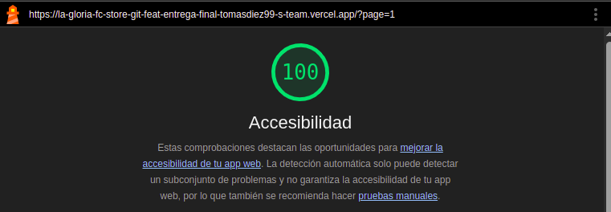